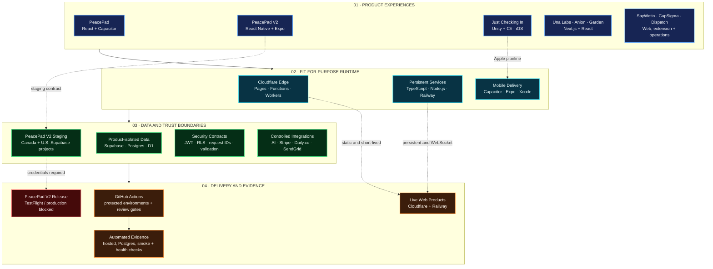

<!-- profile-readme -->

  

<h2 align="center">Technical Product Builder | Enterprise Systems Analyst | iOS, AI Workflow & API Platform Delivery</h2>

I build production-minded web and iOS platforms that connect product strategy, secure AI workflows, APIs, data, and delivery operations.

  
  
  

---

<table>
<tr>
<td width="34%" valign="top" align="center">
  
    
  <b>Toronto, Ontario, Canada</b> 
  <b>15+ years in enterprise delivery</b> 
  <b>Business, systems, data, and product execution</b>
    
  <b>LANGUAGES</b> 
  English &nbsp;•&nbsp; French &nbsp;•&nbsp; Spanish
    
  <b>CORE TECH STACK</b> 
  TypeScript &nbsp;•&nbsp; React &nbsp;•&nbsp; React Native 
  Next.js &nbsp;•&nbsp; Node.js &nbsp;•&nbsp; Supabase 
  PostgreSQL &nbsp;•&nbsp; Cloudflare &nbsp;•&nbsp; iOS
</td>
<td width="66%" valign="top">

## About

I am a technical builder and enterprise systems leader who turns messy business operations into structured, secure, usable platforms. My work sits between product, engineering, business analysis, QA/UAT, data, APIs, and rollout governance.

I have led and built across retail, logistics, public sector, operations, family-tech, mobile games, AI tooling, and service platforms. The common thread is practical delivery: clarify the problem, map the system, build the workflow, prove it works, and keep privacy/security boundaries clean.

My iOS experience spans Capacitor-based product delivery, a guarded native PeacePad V2 staging architecture, and Unity-to-Xcode release automation for **Just Checking In** through TestFlight and App Store workflows.

**What I want people to see here:** I do not only write ideas down. I ship working products, maintain live systems, document execution, and design technical workflows that real users can operate.

</td>
</tr>
</table>

  
  
  
  
  
  
  
  
  

## Live Product Portfolio

| Product | What it proves | Technical scope | Link |
|---|---|---|---|
| **PeacePad** | Family-tech product thinking, AI-assisted communication, calm UX, privacy-aware workflows | React, TypeScript, Node/API, Supabase, Railway/Cloudflare, Capacitor |  |
| **PeacePad V2** | Regional mobile architecture, secure family coordination, privacy-minimized records, offline recovery and evidence-led release gates | React Native/Expo, TypeScript, Deno Edge Functions, Supabase/Postgres, Canada/U.S. staging, Terraform controls | **45% BUILT · STAGING BLOCKED** |
| **Just Checking In** | Mobile-game delivery, Unity engineering, Apple signing/release automation, TestFlight and App Store operations | Unity, C#, iOS export, Xcode archive/signing, TestFlight delivery scripts | **iOS RELEASE PIPELINE** |
| **Una Labs** | AI product studio, client intake, product pages, checkout and delivery positioning | Next.js, Cloudflare, Supabase, Stripe, product ops |  |
| **Anion** | Scheduling, tutoring operations, live classroom, role-based platform flows | Next.js, Supabase, Stripe, Daily.co, Cloudflare Worker |  |
| **SayWetin** | Speech/music/slang recognition product, browser/mobile direction, API-backed utility | React/TypeScript, Node API, Railway, Postgres, extension architecture |  |
| **CapSigma Growth Desk** | Sales agent command center, lead intelligence, outreach proof, client-ready handoff | Cloudflare Pages/Functions, D1 patterns, SendGrid/OpenAI workflows, proof ledger |  |
| **Garden Cleaners** | Service-business booking, client portal, operational web presence | Next.js, Supabase, Stripe, production web ops |  |
| **Dispatch / Internal Ops** | Lightweight operational routing, health checks, private/public service boundaries | Cloudflare, API endpoints, ops automation |  |

## FTC Product Architecture

FTC uses a cost-conscious platform model: edge delivery for web experiences, persistent services only where required, isolated product data, and evidence-backed release controls. PeacePad V2 remains a lab/staging programme—its hosted and PostgreSQL checks do not imply TestFlight or production readiness.

  

<b>View the accessible technical flowchart</b>

 

**Architecture principles:** edge-first delivery, persistent compute only when needed, one canonical Dispatch source, isolated product data, least-privilege access, and no production claim without current evidence.

## Portfolio Repository

The main public build repository is:

  

It contains product code, platform scripts, operational documentation, health checks, and evidence of delivery across the FTC product suite. Some client-facing or privacy-sensitive work remains private by design.

## Technical Strengths

### Product, Systems, And Delivery
- Product strategy, roadmap slicing, rollout planning, and stakeholder-ready documentation
- Business systems analysis across ERP, WMS, POS, logistics, service operations, and public-sector workflows
- QA/UAT planning, acceptance criteria, release readiness, and defect triage
- Enterprise data delivery, reporting logic, source-to-target thinking, and operational dashboards

### Full-Stack And Platform Work
- TypeScript, JavaScript, React, Next.js, Node.js, Python
- iOS delivery with Capacitor, native staging architecture, Unity/C#, Xcode archives, signing, TestFlight, and App Store workflows
- API design, integration mapping, webhook flows, worker functions, and service health checks
- Supabase, Postgres, Cloudflare, Railway, Stripe, Daily.co, SendGrid
- GitHub Actions, scheduled jobs, production smoke tests, secrets hygiene, and deployment verification

### AI And Secure Workflow Systems
- AI-assisted product workflows with human approval checkpoints
- LLM proxy and agent gateway patterns
- Prompted workflow tools for outreach, communication support, discovery, and proof-backed operations
- Privacy-conscious architecture: least-privilege access, private repos where appropriate, and no public exposure of client/user secrets

## Security And Privacy Posture

- Public profile links only expose intended product surfaces, policies, and portfolio repositories.
- Private product code and sensitive client/user data remain private unless they are explicitly safe to publish.
- Live products are checked through production smoke tests and health endpoints where available.
- Operational docs distinguish verified, unverified, blocked, and private states instead of overstating success.
- Secrets and credentials are not intentionally stored in this profile or public README.

## Featured Projects And Docs

| Area | Repository / Surface | Why it matters |
|---|---|---|
| Public portfolio | [FTC-HOLDING](https://github.com/fefejiro/FTC-HOLDING) | Main product suite, operations scripts, product docs, and build evidence |
| PeacePad privacy | [peacepad-privacy](https://github.com/fefejiro/peacepad-privacy) | Public policy/trust surface for PeacePad |
| Consulting profile | [fejiro-it-consulting](https://github.com/fefejiro/fejiro-it-consulting) | Delivery positioning and consulting background |
| PeacePad legacy public repo | [PeacePad](https://github.com/fefejiro/PeacePad) | Public historical project surface |

## GitHub Signal

| Signal | Current public evidence |
|---|---|
| Main public build repo | [FTC-HOLDING](https://github.com/fefejiro/FTC-HOLDING), a TypeScript portfolio monorepo |
| Live products represented | PeacePad, Una Labs, Anion, SayWetin, CapSigma, Garden Cleaners, Dispatch |
| Native GitHub achievement | Pull Shark |
| Public repo posture | Portfolio and policy surfaces are public; sensitive product/client code stays private by design |
| Delivery proof | Product docs, health checks, production smoke scripts, API verification, rollout notes |

## Tech Stack

| Capability | Technologies in use |
|---|---|
| **Web and product UI** | TypeScript, JavaScript, React, Next.js, Vite, Astro, Tailwind CSS |
| **Mobile and games** | React Native, Expo, Capacitor, Unity, C#, iOS, Xcode, Android |
| **APIs and edge** | Node.js, Express, Deno Edge Functions, Cloudflare Pages/Functions/Workers, REST, WebSockets |
| **Data and identity** | Supabase, PostgreSQL, D1, Row Level Security, JWT, schema migrations |
| **Cloud and delivery** | Cloudflare, Railway, GitHub Actions, protected environments, Terraform, Docker |
| **Commercial integrations** | Stripe, Daily.co, SendGrid, webhooks, AI-assisted workflows |
| **Quality and trust** | Playwright, Jest, Vitest, health/readiness checks, request tracing, privacy-minimized audit evidence |
| **Enterprise delivery** | Azure DevOps, Jira, ServiceNow, SAP, ERP, WMS, POS, QA/UAT and release governance |

  
  
  
  
  
  
  
  
  
  
  
  
  
  
  
  
  
  
  
  
  
  
  
  
  
  
  
  
  

## Connect

  
  
  
  
  
  

Direct email: <a href="mailto:fejiro.efiuvwere@gmail.com">fejiro.efiuvwere@gmail.com</a>

  

<!-- profile-refresh: 2026-08-10 -->
